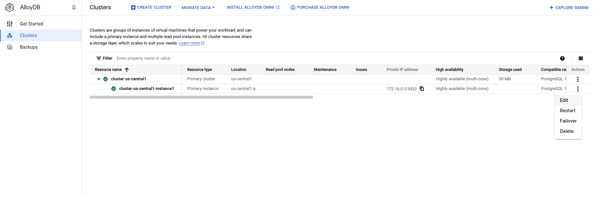
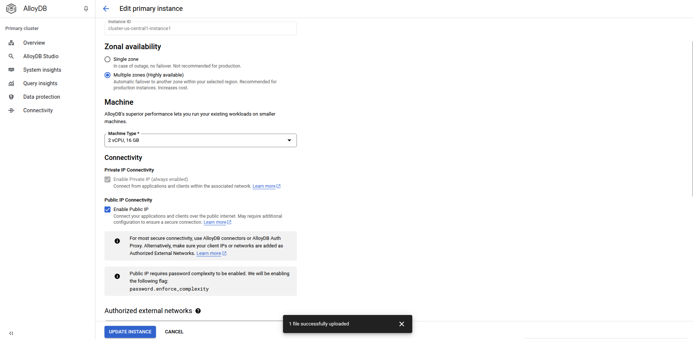
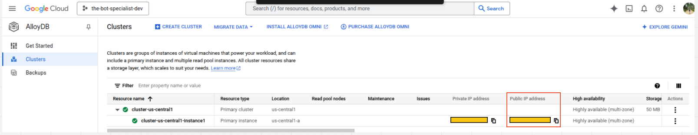
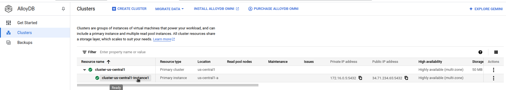
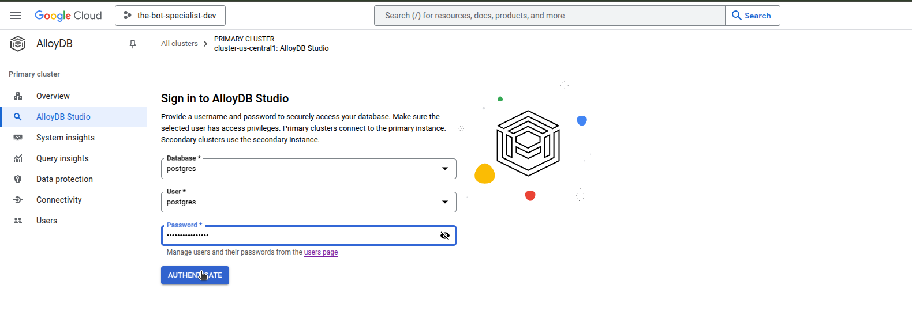
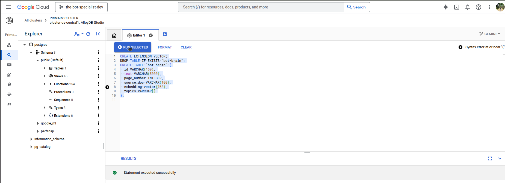

# 📄 doc_ingestion_pipeline

## 🚀 Overview

The doc_ingestion_pipeline is a powerful and automated pipeline designed to ingest and process PDF documents seamlessly. Whenever a user uploads a PDF file to a 📦 Google Cloud Storage (GCS) bucket, it triggers a ⚡ Dataflow pipeline that:

- 📜 Extracts text from the PDF.
- 🧩 Splits the extracted text into manageable chunks.
- 🏷️ Identifies key topics using a 🤖 Large Language Model (LLM).
- 🧠 Generates embeddings for the text chunks.
- 💾 Stores these embeddings in a vector database along with their metadata for efficient retrieval.

### 🤖 Integration with bot-specialist

This repository serves as a microservice within a larger system known as bot-specialist. The goal of bot-specialist is to simplify information retrieval for users by providing accurate and explainable responses. Users can not only obtain answers but also verify the sources used to generate them.

An illustration of the full system architecture is shown below:


This repository is a microservice of bigger system noun as bot-specialist, which purpose make easier for the user
retrieve information as well as giving to him ways to check bot answer pointing where user can find the information used as base to bot build its answer

An ilustration of all system can be seen below:


## 🏁 Getting Started

### Pre-Requisites
 - Having a Google account with billing account and project set up on GCP.
 - Having an OpenAI account with credits available and API key in hands.
 - You have to have python3.11 installed on your local machine.
 - It's necessary run this application on linux or MacOS

### Steps

1. - Install all dependencies and set up project locally
```sh
  $> make init
```
2. - Replace all tags to your projects and resources configuration on `app-configs-example.yaml` and rename it to `app-configs.yaml`
3. -  Got to `terraform/environments/dev/main.tf` and change all configs commented according your project configuration
4. - Provision all resourcer need for project running:
```shell
$> src/bash/provisioning.sh \
   --env dev \
   --project-id "<PROJECT_ID>" \
   --pipeline-bucket "doc-ingestion-pipeline-dev-<PROJECT_NUMBER>" \
   --registry-repo-name "<REGISTRY_REPOSITORY_NAME>" \
   --container-image "<CONTAINER_IMAGE_TAG>" \
   --project-number "<PROJECT_NUMBER>" \
   --region "<REGION>"
```
5. On google  cloud console go to AlloyDB > Clusters > Click 3 dot in any instance > edit > enable public ip address
6. Go to GCP console and search for alloyDB, then go to cluster tab, then click on 3 dot in one of instance cluster:



7. Enable public IP Access on AlloyDB Cluster then click on 'update instance' button to save new configs


8. Copy the public IP Address of instance, then replace tag '<INSTANCE_PUBLIC_ADDRESS>' on `app-config.yml` by the instance public IP address

9. Click on instance at alloyDB cluster tab:

10. Got to Users tab then create a username and password according your preference, then click add to add new user:
!
11. Go to AlloyDB Studio tab then login

12. Create `bot-brain` table running the query at `src/queries/creaete_brain_table.sql`

13. Go to your pdf bucket repository and upload a pdf file there\
14. Go to dataflow worker logs a see magic happening\

15. After the pipeline finished to run you can check if data were properly saved on AlloyDB postgres database with:
```sql
SELECT * FROM bot-brain;
```
## 🤲 Contributing

Contributions are welcome! Feel free to open issues, submit pull requests, or suggest improvements to enhance this pipeline. 🚀
