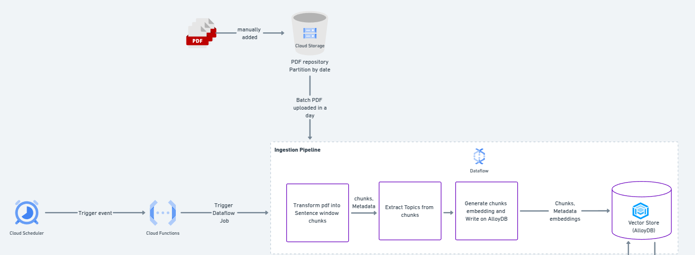

# 📄 doc_ingestion_pipeline

## 🚀 Overview

The doc_ingestion_pipeline is a powerful and automated pipeline designed to ingest and process PDF documents seamlessly. Whenever a user uploads a PDF file to a 📦 Google Cloud Storage (GCS) bucket, it triggers a ⚡ Dataflow pipeline that:

- 📜 Extracts text from the PDF.
- 🧩 Splits the extracted text into manageable chunks.
- 🏷️ Identifies key topics using a 🤖 Large Language Model (LLM).
- 🧠 Generates embeddings for the text chunks.
- 💾 Stores these embeddings in a vector database along with their metadata for efficient retrieval.

### 🤖 Integration with bot-specialist

This repository serves as a microservice within a larger system known as bot-specialist. The goal of bot-specialist is to simplify information retrieval for users by providing accurate and explainable responses. Users can not only obtain answers but also verify the sources used to generate them.

An illustration of the full system architecture is shown below:




This repository is a microservice of bigger system noun as bot-specialist, which purpose make easier for the user
retrieve information as well as giving to him ways to check bot answer pointing where user can find the information used as base to bot build its answer

An ilustration of all system can be seen below:


## 🏁 Getting Started

### Pre-Requisites
 - Having a Google account with billing account and project set up on GCP.
 - Having an OpenAI account with credits available and API key in hands.
 - You have to have python3.11 installed on your local machine.
 - It's necessary run this application on linux or MacOS

### Steps

1. - Install all dependencies and set up project locally
```sh
  $> make init
```
2. Exchange all TAGs (less db_host) at `app-configs-template.yaml` with your projects parameters and rename it to `app-configs.yaml`
3. Provision all GCP resouces need by project run provisioning.sh as example below:
```sh
src/bash/provisioning.sh \
   --env dev \
   --mode "CREATE"\
   --project-id "the-bot-specialist-dev" \
   --project-number "150030916493" \
   --region "us-central1" \
   --location "US" \
   --cloud-function-name "trigger-pdf-ingestion-dataflow-job"\
   --cron-job-name "trigger-pdf-ingestion-schedule" \
   --cron-shedule "50 16 * * *" \
   --cron-timezone "America/Sao_Paulo"
``` 

4. Then exchange manually on app-configs.yaml the alloyDB instance public ID created on provisioning.sh
```yaml
CONNECTIONS:
  ALLOYDB:
    DEV:
      connection_name: "the-bot-specialist-dev:us-central1:vector-store-dev"
      region: "us-central1"
      cluster: "cluster-us-central1-dev"
      instance: "cluster-us-central1-instance1-dev"
      database: "postgres"
      table_name: "bot-brain"
      project_id: "the-bot-specialist-dev"
      db_schema: "public"
      db_host: "<ALLOYDB-INSTANCE-PUBLIC-IP>" # ←  put here  the new public ip address create where
      db_user: "<ALLOY_DB_USER>"
      db_password: "<PASSWORD>"
      db_port: 5432
      db_name: "postgres"
      use_private_ip: False
```

4. Upload config file to cloud secrets and name it as 'doc-ingestion-pipeline-secrets'

5. Go to AlloyDB Studio and run the following query using 'user-dev' credentials, then run the query below there:
```sql
    CREATE EXTENSION vector;
    DROP TABLE IF EXISTS "bot-brain";
    CREATE TABLE "bot-brain" (
      id VARCHAR(150),
      text VARCHAR(5000),
      page_number INTEGER,
      source_doc VARCHAR(100),
      embedding vector(768),
      topics VARCHAR[]
);
```

6. Then run all process to setup pipeline running setup_pipeline.sh as follows:
```sh
src/bash/pipeline_setup.sh \
	--env "dev" \
	--registry-repo-name "bot-especialist-repo" \
	--container-image "doc-ingestion-pipeline-dev:v1.1" \
	--project-id "the-bot-specialist-dev" \
	--project-number "150030916493" \
	--region "us-central1"
```
7. To test doc ingestion pipeline dataflow job, go to cloud schedule and click on option force run on 'trigger-pdf-ingestion-dataflow-job'

8. Check logs, check if dataflow job runned as expected, finally check if 'bot-brain' was populated running this query on alloyDB Studio:

```sql
SELECT * from bot-brain;
```
```
## 🤲 Contributing

Contributions are welcome! Feel free to open issues, submit pull requests, or suggest improvements to enhance this pipeline. 🚀
